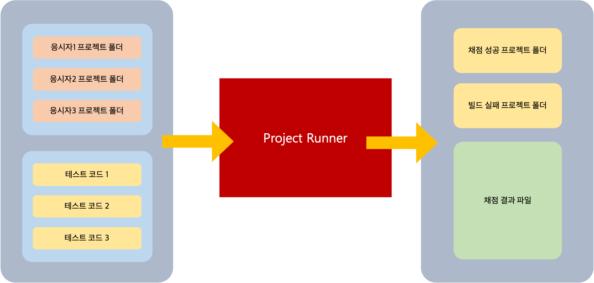

# Architecture

본 프로젝트는 과제테스트를 자동으로 채점하기 위해 만들어진 툴입니다. 파이썬3을 사용하여 제작되었습니다.

실행하기 위하여 응시자의 프로젝트 폴더들과 채점에 사용할 테스트 코드가 필요하고 코드를 일부 수정하여 경로를 설정하는 과정이 필요합니다. 자세한 설정방법은 REAMDE파일에 설명되어 있습니다.

파일의 결과물은 응시자들의 프로젝트를 테스트코드로 채점한 결과물이며 통과한 항목의 케이스들이 json 파일에 저장됩니다. 그리고 응시자들의 코드를 빌드에 실패한 케이스, 채점을 성공한 케이스로 나누어 저장합니다.

# Code Map

## `requirements.txt`

해당 프로젝트에서 사용하는 패키지들이 적혀있는 텍스트파일입니다.

## `xxxxxx_project_runner/data/`

채점 대상인 응시자들의 프로젝트 폴더와 채점 결과를 저장하는 폴더입니다

## `xxxxxx_project_runner/data/origin_data`

채점 대상인 응시자들의 프로젝트 폴더들을 담는 곳입니다.

## `xxxxxx_project_runner/data/fail_data`

채점 과정에서 빌드에 실패한 응시자의 프로젝트 폴더들이 담기는 곳입니다.

## `xxxxxx_project_runner/data/pass_data`

채점을 성공한 응시자의 프로젝트 폴더들이 담기는 곳입니다.

## `xxxxxx_project_runner/data/progress_data`

채점을 진행 중인 응시자들의 프로젝트 폴더가 담기는 곳입니다.

## `xxxxxx_project_runner/data/final_result.json`

프로젝트 실행 이후 채점 결과가 저장되는 json 파일입니다. 응시자의 프로젝트 폴더 이름을 키 값으로 가지고 테스트 코드에서 통과한 항목들의 배열을 값으로 가집니다. 빌드를 실패했을 경우 'build_and_parse Fail'라는 값이 저장됩니다.

## `run.py`

프로젝트의 엔트리포인트입니다. 응시자 프로젝트 폴더들의 경로를 테스트를 실시하는 함수로 전달합니다.

## `xxxxxx_project_runner/`

채점에 사용할 테스트 코드들과 채점 과정에서 사용되는 함수들이 있는 파일들이 담긴 폴더입니다.

## `xxxxxx_project_runner/resources/`

채점에 사용할 테스트 코드들이 담긴 폴더 입니다. 채점 시 폴더 안의 내용을 모두 복사하기 때문에 여러 파일이나 폴더형태로 존재할 수 있습니다.

## `xxxxxx_project_runner/constants.py`

코드에서 사용하는 주요 상수 값을 담고 있는 파이썬 파일입니다. 파일의 경로, 파일명, 로그에 사용되는 상수 값 등을 담고 있습니다.

_중요한 상수 값들은 다음과 같습니다._

- TEST_FILES_RELATIVE_PATH: 과제테스트 초기 코드의 테스트코드 경로입니다. 테스트를 실행하기 위해 꼭 수정되어야하는 값입니다.
- RESOURCE_PATH: 응시자 프로젝트 폴더에 삽입될 테스트 코드가 존재하는 폴더의 경로입니다.
- FINAL_JSON_FILE_PATH: 결과 파일이 저장될 경로입니다.
- SUREFILE_REPORTS: 테스트 코드 실행 후 결과 값이 담기는 폴더 경로입니다. _spring_project_runner에만 존재합니다._

## `xxxxxx_project_runner/main.py`

채점 과정에 사용되는 주요 코드들이 있는 파이썬 파일입니다.

- parse: 테스트 코드 실행 후 생성된 결과 파일을 파싱합니다.
- build_and_parse: 테스트 코드를 실행하고 parse함수를 호출하여 테스트 결과를 배열에 담아 반환합니다.
- test_single: preprocess함수와 postprocee함수를 호출합니다.
- test_multiple: 모든 응시자 프로젝트에 대해 test_single함수를 호출한 후 결과를 json파일에 저장합니다.

## `xxxxxx_project_runner/preprocess.py`

채점 과정에서 테스트 코드를 실행 시키기 전 사용되는 함수들이 있는 파이썬 코드입니다.

- preprocess: preprocess의 전반적인 처리를 담당합니다. 응시자 프로젝트 폴더 안에 테스트 코드들을 삽입하고 채점할 환경을 세팅합니다.
- unzip: zip파일의 압축을 해제하는 함수입니다.
- find_project_path: 응시자 프로젝트의 루트 경로를 찾는 함수입니다. pom.xml파일의 위치를 기반으로 찾습니다.
- remove_target_file: 응시자 프로젝트 폴더에서 기존의 target file을 삭제하는 함수입니다.
- replace_test_file: 테스트 코드들을 응시자 프로젝트 폴더 안으로 복사하는 함수입니다.

## `xxxxxx_project_runner/postprocess.py`

채점 과정을 마치고 난 후 실행될 함수들이 있는 파이썬 코드입니다. 채점 결과에 따라 응시자 프로젝트 폴더를 `pass_data`, `fail_data`로 나누어 저장하고 `progress_data`에서 제거합니다.

## `xxxxxx_project_runner/log.py`

로그와 관련된 함수를 담고 있는 파이썬 코드입니다.
